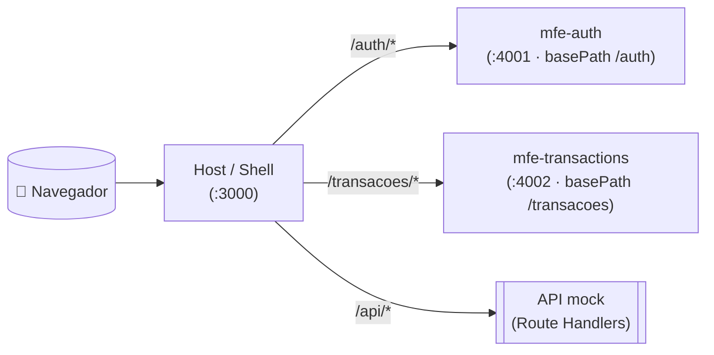

`PÓS TECH: FRONT-END ENGINEERING/2026`
<h1>
  
  Projeto FinanceApp
</h1>

Aplicação de gerenciamento financeiro, com o objetivo de oferecer uma interface intuitiva que permita aos usuários controlar e gerenciar suas transações financeiras de forma eficiente.

Nesta fase, a aplicação evoluiu para uma arquitetura de **Microfrontends** usando **Next.js Multizones**: um _shell_ (host) que integra dois microfrontends independentes (autenticação e transações), além de uma API _mock_ servida pelo próprio host.

<br>

## Integrantes
* [Gisele Cardoso](https://github.com/Gisele-Cardoso)
* [Guilherme Neves Trindade](https://github.com/Guilhermeneves142)
* [Tayane Milagres](https://github.com/taymilagres)
* [Vandrei de Lima](https://github.com/vandreilima)

<br>

## 🌐 Acesse online

🔗 **Aplicação:** [tech-challenge-one.vercel.app](https://tech-challenge-one.vercel.app/)

> **Credenciais de teste:** `joao@financeapp.com` / `123456`
> _(a escrita de dados na nuvem é efêmera — é um ambiente de demonstração)_

<br>

##  Composição geral
* Login, Cadastro e Recuperação de senha
* Home / Dashboard com widgets e gráficos
* Listagem de transações com filtros
* Modais de adição, edição e remoção de registros de transações

<br>

## Tecnologias utilizadas

* **Desenvolvimento:** Next.js 16, React 19, TypeScript, Tailwind, shadcn/cn
* **Microfrontends:** Next.js Multizones (proxy via `rewrites`)
* **Gráficos:** Recharts
* **Dados:** API _mock_ via Route Handlers do Next (`/api`)
* **Containerização:** Docker + Docker Compose
* **Design System:** Figma
* **Documentação de componentes:** Storybook

<br>

## 🧩 Arquitetura (Microfrontends · Multizones)

A aplicação é composta por **3 repositórios** independentes. O host faz o _proxy_ das
zonas via `rewrites` no [`next.config.ts`](./next.config.ts), de modo que o usuário
navega tudo a partir de uma **única URL** (a do host).



| App | Porta (dev) | Papel | Repositório |
|---|---|---|---|
| **Host / Shell** | `3000` | Layout, dashboard, proxy das zonas e **API em `/api`** | [tech-challenge](https://github.com/Guilhermeneves142/tech-challenge) |
| **mfe-auth** | `4001` | Login, cadastro, recuperar senha (`/auth`) | [tech-challenge-mfe-auth](https://github.com/Guilhermeneves142/tech-challenge-mfe-auth) |
| **mfe-transactions** | `4002` | Transações (`/transacoes`) | [tech-challenge-mfe-transactions](https://github.com/Guilhermeneves142/tech-challenge-mfe-transactions) |

> A API _mock_ deixou de ser um `json-server` externo e passou a viver no host como
> Route Handlers em `src/app/api`. Em local/Docker ela persiste em `mock/db.json`;
> na nuvem (serverless) a escrita é efêmera.

<br>

## Arquitetura de pastas (host)
```bash
TECH-CHALLENGE/
├── mock/                       # db.json (seed dos dados) + servidor legado
├── src/
│   ├── app/
│   │   ├── (main)/             # área autenticada (dashboard, etc.)
│   │   │   └── dashboard/
│   │   ├── api/[...path]/      # API mock (mini json-server)
│   │   └── layout.tsx
│   ├── components/             # componentes do shell
│   ├── features/               # dashboard-widgets, etc.
│   ├── lib/                    # clientes de API e utilidades
│   ├── server/                 # acesso a dados server-only (SSR)
│   ├── shared/  ·  store/  ·  styles/
│   └── proxy.ts                # auth guard (middleware)
├── Dockerfile · docker-compose.yml · DOCKER.md
└── next.config.ts              # rewrites das zonas (multizone)
```
<br>

##  Demonstração
🔗 **Vídeo de demonstração:** [Video](https://www.youtube.com/watch?v=G0iU-HV3PUs)
<br>
🔗 **Design System:** [Figma](https://www.figma.com/design/3U3w8niWGklunFZzrSCGto/Tech-Chalenger?node-id=52-1791&t=ZNWD9qu4LBWp7f2j-0)

<br>

## ▶️ Como rodar localmente

#### _Pré-requisitos:_
* Node.js >= 22.14
* npm ou yarn
* Os **3 repositórios clonados lado a lado** (o host orquestra os MFEs):

```
faculdade/
├── tech-challenge/            # este repositório (host)
├── tech-challenge-mfe-auth/
└── tech-challenge-mfe-transactions/
```

```bash
# Clone os 3 repositórios na mesma pasta
git clone https://github.com/Guilhermeneves142/tech-challenge.git
git clone https://github.com/Guilhermeneves142/tech-challenge-mfe-auth.git
git clone https://github.com/Guilhermeneves142/tech-challenge-mfe-transactions.git

# Instale as dependências de cada um
npm install --prefix tech-challenge
npm install --prefix tech-challenge-mfe-auth
npm install --prefix tech-challenge-mfe-transactions

# A partir do host, suba tudo (host + 2 MFEs) de uma vez
cd tech-challenge
npm run dev

# Abra o link do host (Ctrl + clique)
http://localhost:3000
```
<br>

## 🐳 Como rodar com Docker

O projeto inteiro sobe em **um único container** (modo desenvolvimento). Requer Docker
Desktop e os 3 repositórios lado a lado.

```bash
# A partir da pasta tech-challenge
docker compose up --build

# Abra
http://localhost:3000
```

📄 Passo a passo completo (e o deploy na Vercel) em **[DOCKER.md](./DOCKER.md)**.

<br>

## Como acessar o Storybook dos componentes
#### _Pré-requisitos:_
* Ter o repositório clonado na sua máquina
* Todas as dependencias do projeto instaladas _(conforme citado acima)_

```bash

# Abra o terminal e rode o comando abaixo
npm run storybook

# Abra o link disponibilizado no terminal (Ctrl + clique)

```
